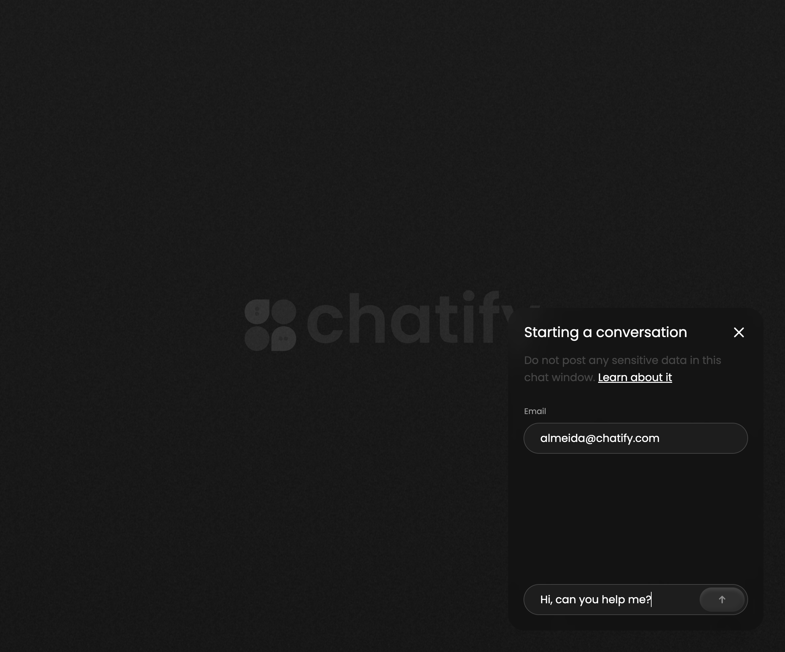
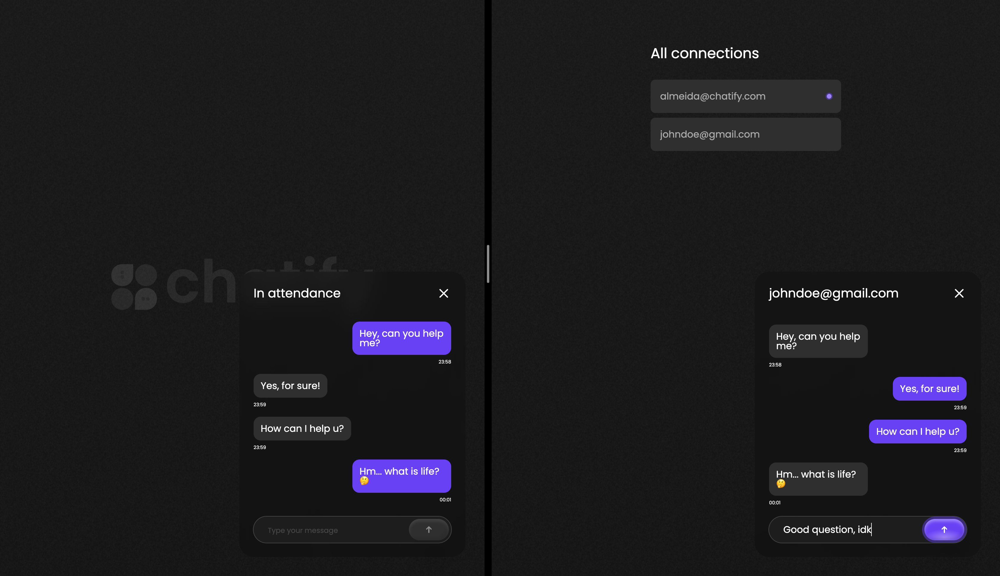

<br>

<h1 align="center">
  
</h1>

<br>

<p align="center">
  <a href="#-About">About</a>
  &nbsp;&nbsp;&nbsp;|&nbsp;&nbsp;&nbsp;
  <a href="#-Technologies">Technologies</a>
  &nbsp;&nbsp;&nbsp;|&nbsp;&nbsp;&nbsp;
  <a href="#-Features">Features</a>
  &nbsp;&nbsp;&nbsp;|&nbsp;&nbsp;&nbsp;
  <a href="#-How-to-use">How to use</a>
</p>

<p align="center">
  
  
</p>

<p align="center">
  
  
</p>

<p align="center">
  
</p>

<p align="center">
  
</p>

<br>

### 🤳 About

Chatify is your ultimate chat application. With its intuitive interface and robust features, Chatify enables seamless, real-time interactions, making it easier than ever for businesses to address customer inquiries and concerns promptly.

<br>

### 🚀 Technologies

#### Web

- [Vite](https://vitejs.dev/)
- [Vue 3](https://vuejs.org/)
- [Vue Router](https://router.vuejs.org/installation.html)
- [Plugin Vue JSX](https://github.com/vitejs/vite-plugin-vue/tree/main/packages/plugin-vue-jsx)
- [Socket.io (Client API)](https://socket.io/docs/v4/client-api/)
- [Moment](https://momentjs.com/)
- [TypeScript](https://www.typescriptlang.org/)

#### Server

- [Node](https://nodejs.org/en)
- [TSX](https://www.npmjs.com/package/tsx)
- [TypeORM](https://typeorm.io/)
- [SQLite](https://www.sqlite.org/index.html)
- [Express](https://expressjs.com/pt-br/)
- [Socket.io (Server API)](https://socket.io/docs/v4/server-api/)
- [TypeScript](https://www.typescriptlang.org/)

<br>

### 🪄 Features

#### User

- Start a chat
- Send message for admin
- Receive message

#### Admin

- Send message for multiple users
- Receive message

<br>

### 🧑‍💻 How to use

**First things first:** [NodeJS](https://nodejs.org/en/download) must be installed.

```bash
# Clone this repo

$ git clone https://github.com/Almeida154/chatfiy.git
```

```bash
# Install web dependencies and start it

$ cd web
$ yarn install
$ yarn dev
```

```bash
# Now the server turn

$ cd ..
$ cd server
$ yarn install
```

```bash
# Run migrations and start it

$ yarn migrations:run
$ yarn dev
```
